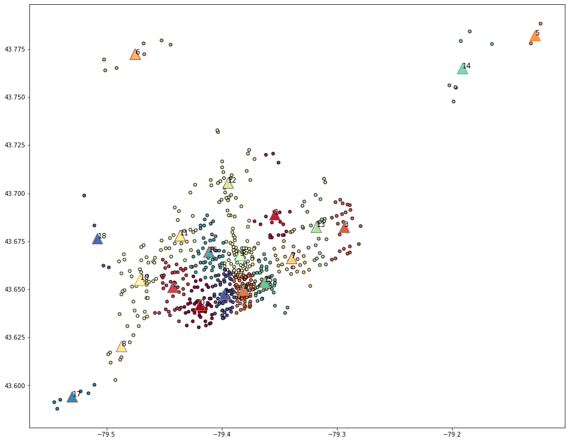
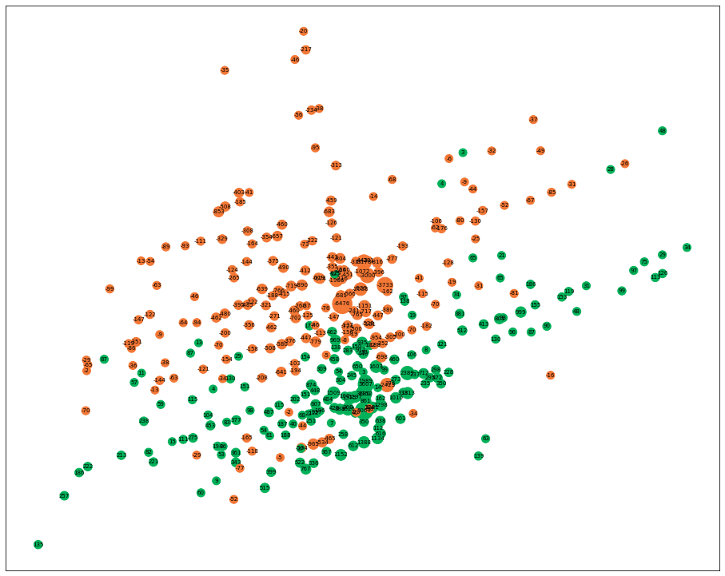
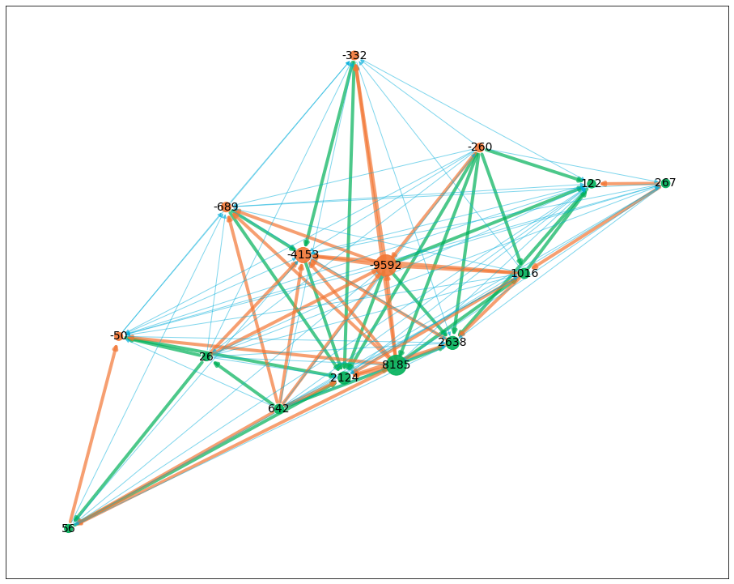

# MODELING TORONTO BIKESHARE DATASET USING K-MEANS CLUSTERING
Modeling Toronto bike-share dataset using k-means clustering

## Description
### Dataset
Toronto Bikeshare Data

### Link Dataset
Toronto Bikeshare Data on Kaggle

https://www.kaggle.com/jackywang529/toronto-bikeshare-data/download

### Context 
The Bike Share Toronto Ridership data contains anonymized trip data, including:
Trip start day and time, Trip end day and time, Trip duration, Trip start station, Trip end station, User type

### Content
In this dataset, we have the bike sharing information form 2017 and 2018.

### Metadata
    Usage Information             License                     Other (specified in description)
                                  Visibility                  visibility Public 
    
    Provenance                    Sources                     (https://open.toronto.ca/dataset/bike-share-toronto-ridership-data/)
                                  Collection methodology      Collected from https://open.toronto.ca/dataset/bike-share-toronto-ridership-data/ on 2/4/2020.

    Maintainers                   Dataset owner               JackyWang (https://www.kaggle.com/loganalive)

    Updates                       Expected update frequency   Annually
                                  Last updated                2020-02-05                
                                  Date created                2020-02-05                  
                                  Current version             Version 2

### Atribut Dataset

*   **trip_id**: unique identifier for each trip
*   **trip_start_time**: time when the trip started
*   **trip_stop_time**: time when the trip ended
*   **trip_duration_seconds**: duration of the trip measured in seconds
*   **from_station_id**: station ID where the trip started
*   **from_station_name**: name of the station where the trip started
*   **to_station_id**: station ID where the trip ended
*   **to_station_name**: name of the station where the trip ended
*   **user_type**: identify if the user has a membership or purchased a pass

### **Acknowledgements**
This dataset is from Toronto Parking Authority, published on https://open.toronto.ca/dataset/bike-share-toronto-ridership-data/. You may find the latest complete dataset from there.

The data is licensed under: [Open Government License - Toronto](https://open.toronto.ca/open-data-license/)

## References
It might seem to be intuitive that bikeshare users would travel in the reverse direction in the evening than in the morning.

But how true is that? If that's the case, would it reduce the value of convenience of bikeshares being available everywhere,
and should they just get their own bikes? Do we also need a crew to pick up and restore all the bikes to initial distributions across the city before the next morning?

1.   Find out what percentage of bikes are returned to its initial location?
2.   How many bikeshare trips usually visit more than just start/end points, but visited some other points before the end of the day?

References for code programming/articles
- [Memahami K-Mean Clustering Pada Machine Learning Dengan Phyton](https://medium.com/@16611129/memahami-k-mean-clustering-pada-machine-learning-dengan-phyton-430323d80868)
- [Exploring Toronto Bike Share Ridership using Python](https://towardsdatascience.com/exploring-toronto-bike-share-ridership-using-python-3dc87d35cb62)
- [Bike availability in the station](https://www.kaggle.com/iwanmanurung/bike-availability-in-the-station)
- [See the flow of bikes](https://www.kaggle.com/yclaudel/see-the-flow-of-bikes)

## Objectives
1.   Find out the Top 10 Stations with the highest number of a two-way traveler using EDA?
2.   How to predict the flow of bikes. Are bikes returned to their initial location? Or are there flows of bikes from one region to another?

## Results

Top 10 Stations with the highest number of two-way traveler
	
      from_station_name                               to_station_name
      
      Bay St / Queens Quay W (Ferry Terminal)         3515
      Humber Bay Shores Park West                     2162
      York St / Queens Quay W                         1969
      Ontario Place Blvd / Lakeshore Blvd W           1746
      Tommy Thompson Park (Leslie Street Spit)        1742
      HTO Park (Queens Quay W)                        1606
      Lakeshore Blvd W / Ellis Ave                    1562
      Lakeshore Blvd W / Windermere Ave               1238
      Lakeshore Blvd W / Ontario Dr                   1201
      Dockside Dr / Queens Quay E (Sugar Beach)       1028
      
Methode to Clustering Model
- KMeans on gps coordinates (nbr_cluster = 20)
(Clustering of the stations in 20 regions)
- Mapping Station. Coordinates of cluster centers and map each station with its region
- Plotting Cluster
- Sum of all travel between 2 nodes during a period
- Extract flows and creates graphs flows by time, stations, and regions. 

Plotting clustering of the stations in 20 regions

Plot the graphs for stations for weekdays in 2018

Plot the graphs for regions for weekends in 2018

